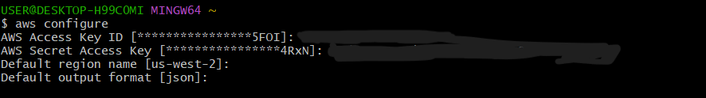
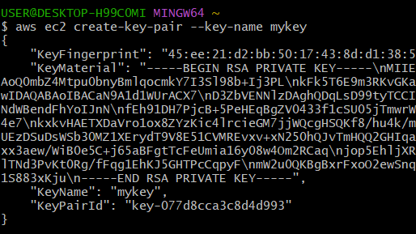
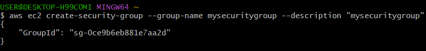
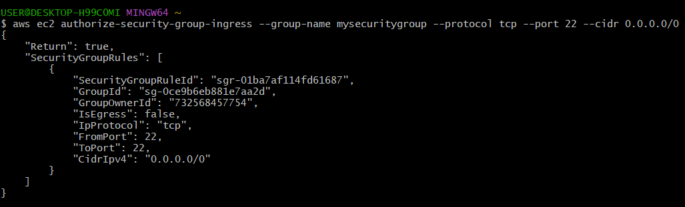
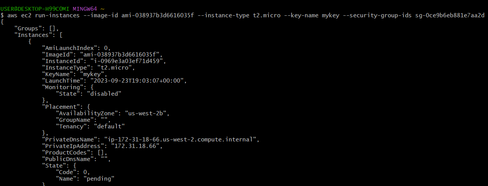
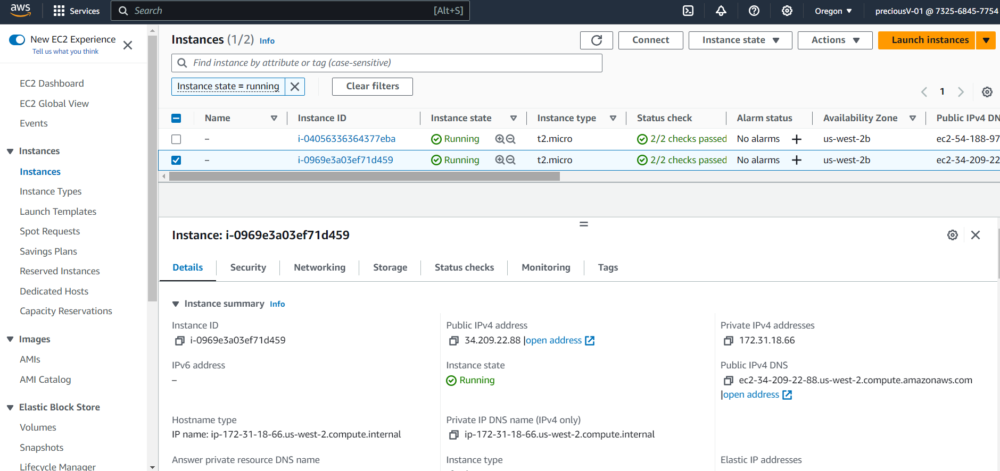

# How to lunch an Ec2 instance from the Command Line Interface

## Install AWS CLI (if not already installed):
If you haven't installed the AWS CLI on your computer, you can download and install it from the AWS official website.

## Configure AWS Credentials:
After installing the AWS CLI, you need to configure your AWS credentials. You can do this by running the aws configure command and providing the required information:   

## Create a Key pair;
use this line of command to create a keypair;
 `aws ec2 create-key-pair --key-name YOURKEYPAIRNAME`

## Create a Security Group;
use this line of command to create a security group;
`aws ec2 create-security-group --group-name yoursecuritygroupname --description "yoursecuritygroupname"`

Run the following command after creating the security group;
`aws ec2 authorize-security-group-ingress --group-name yoursecuritygroupname --protocol tcp--port 22 --cidr 0.0.0.0/0`

## Lunch the Ec2 instance;
use this line of command to lunch an ec2 instance;
`aws ec2 run-instances --image-id ami-xxxxxxxxxx --instance-type t2.micro --key-name YourKeyPairName --security-group-ids sg-xxxxxxxx`

ec2 view from the management console:
